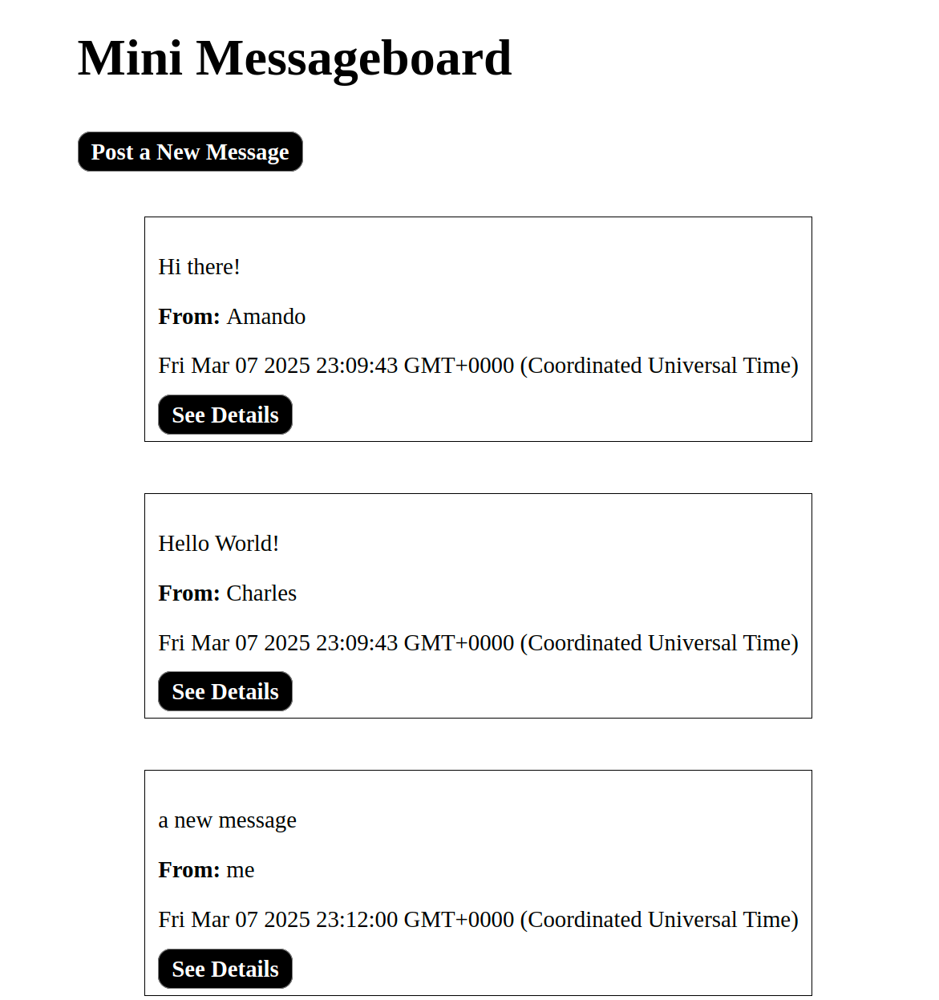

# Mini Message Board

A simple Express-based message board application that lets users view sample messages, add new messages through a form, and view message details on separate pages. This project was built to practice Express fundamentals, routing, and EJS templating.

---

## Table of Contents

1. [Features](#features)
2. [Live Demo](#live-demo)
3. [Technologies Used](#technologies-used)
4. [Usage](#usage)
5. [Future Improvements](#future-improvements)
6. [Contributing](#contributing)
7. [License](#license)

---

## Features

-   **Dynamic Message Listing:** Displays a list of messages with details such as the message text, author, and the time it was added.
-   **Add New Message:** Provides a form at `/new` where users can submit a new message, which is saved to a PostgreSQL database.
-   **Message Details:** Each message includes a link to a dedicated page with full message details.
-   **Express & EJS Templating:** Uses Express for routing and EJS for rendering dynamic HTML views.
-   **Persistent Data Storage:** Messages are stored in a PostgreSQL database so that data persists across server restarts.

---

## Live Demo

Access the live demo here: [Mini Message Board Live Demo](http://mini-message-board-production-0161.up.railway.app)

---

## Technologies Used

-   **Node.js**
-   **Express**
-   **EJS**
-   **JavaScript (ES6+)**
-   **CSS**
-   **PostgreSQL** (via `pg` for database integration)
-   **Express Middleware**

---

## Usage

1. **View Messages from Oldest to Newest**: This is the main view on the homepage.
2. **New Messages**: Click "Post a New Message" to open a form to add new messages.
3. **See Details**: Click on "See Details" to open a page for an individual message.

---

## Future Improvements

-   **Edit & Delete Functionality:**  
    Allow users to update or remove existing messages.
-   **Enhanced UI/UX:**  
    Improve styling and responsiveness.
-   **User Authentication:**  
    Add login functionality for a personalized experience.

---

## Contributing

Contributions, issues, and feature requests are welcome! Feel free to open a pull request or issue.

1. Fork the project
2. Create your feature branch: `git checkout -b feature/your-feature`
3. Commit your changes: `git commit -m 'Add a cool feature'`
4. Push to the branch: `git push origin feature/your-feature`
5. Open a Pull Request

---

## License

This project is licensed under the **MIT License**. Feel free to use, modify, and distribute it as you see fit.
